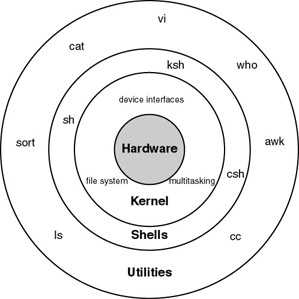

# Shell

> A shell is an interpreter where we can provide commands and get a response. Shells can perform powerful and uncountable number of actions based on the commands,which we provided. Basically, a Shell is a program which runs other programs.

* cp f1 f2
* A shell is an interpreter between user and kernel.
* if execute any command, it provide out put by help of  programs





##   Type of shells


* Bourne shell        $   sh
* Korn shell          $   ksh
* C shell             $  csh
* Bash shell          $   bash       
* Z shell             $   zsh


## Variables:

* it is data name
* It is a temporary  storage location
* It’s value can be change at run time
* In shell there is no data types 
* and each one is treated as string

## Variables are two types:

* 1 User defined  variables
* 2 system defined variables

## 1 User defined  variables
* 1.1  Local variables
* 1.2  Constant variables
* 1.3  Global variables

### 1.1 Local variables:
```
This  variables are available only particular shell,but not available  globaly.
Example:
#a=10
#b=2.0
#name=ram
#comp=” abc tech”
#  echo $a
#  c=$a
#  k=ls
#  echo $k  : ls
#  k=’ls’
#  echo $k  :  display file list

```

### 1.2 constant variables:

* These are all readonly variables

```
Example: 

#x=100
#readonly x
#x=25 : it raises error

```

### 1.3 Global variable:
* it is available for  entire session.  If you want, this variables as permanent then you have to set entry in **_.bash_profile_** file

```
# export x=100
# env
# read    : input from user

```

## 2 system defined variables

```
# SET : display all env variables and with values
# PATH : 

```


## Standard variables

```
0   :standard input
1   :standard output
2   :standard error

Example:
# sh sample.sh 1>stdout.txt 2>stderr.txt

```

## Operators:

```
Arthimetic               :   *   /    -     +    %
Relational numeric       :   -lt  -le   -gt  -ge -eq -ne
Relational string  comp  :    <    >     ==     !=
Logical                  :    -a    -o   !   ||   &&
Assignment               :     =

```

```
ex1:

echo  "enter a  value :"
read  a
echo  "enter b value :"
read  b
echo `expr $a + $b`
echo `expr $a \* $b`
echo `expr $a / $b`
echo `expr $a %  $b`

```

### Input arguments to the script

```
$0   :denotes name of the executing script
$n   :denotes nth argument
$*   :denotes all input arguments entire string as single arg
$$   :denotes PID of the executing script
$#   :no.of  args count 
$@   :denotes all input arguments each word as single arg

```
## Flow control

## conditions

* string comparison: **_if_**

```
 -n  string            :     string is not an empty string, true
 -z string             :     string is an empty string, true
  string1 == string2   :     strings are same,  true
  string1 != string2   :     strings are not same, true


```

* Arithmetic comparison: **_if_** true

```
   exp1 –eq exp2   expressions equal, true
   exp1 –ne exp2   expressions not equal, true
   exp1 –gt exp2   exp1 greater than exp2, true
   exp1 –lt exp2   exp1 less than exp2, true
   ! expression    expression is false

```
* file conditionals: **_if_**

```
-f : true,if it is Regular file.
-d : true,if it is Directory file.
-l : true,if it is link file.
-b : true,if it is block specific file.
-c : true,if it is character specific file.
-e : true,if it is exists file.
-s : true,if it is file is not empty.
-r : true,if it is file has read permissions.
-w: true,if it is file has write permissions
-x : true,if it is file has execute permissions
-z : true,if it is string is empty.
-n : true,if it is string not empty.

```

## If condition:

```
if [ condition ]; then  
smt...  
fi

If [ condition ]; then  smt1  else smt2    fi

If [ condition1 ]; then  smt1 elif [ condition 2  ]; then smt2  else smt3   fi

If [ condition1 ]; then if[ condition2 ]; then smt else  smt fi  else smt   fi


```

```
Example:

if [ $# -gt 0 ]; then
echo  "input argument has given"
else
echo "no input argumet"
fi

```